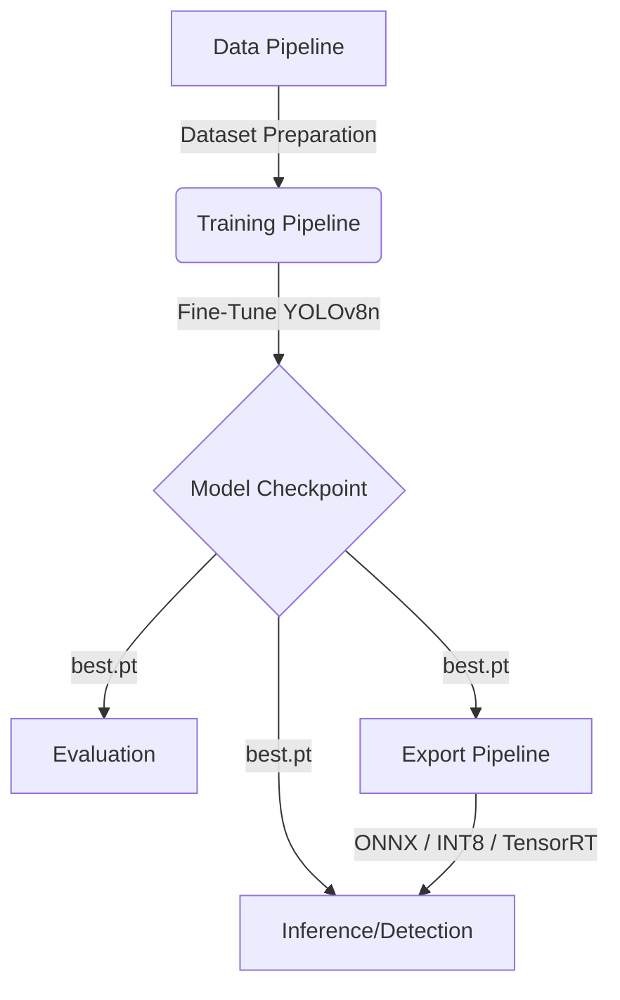

# Firearm Detection System Design Document

## 1. System Overview

The **Firearm Detection System** is an end-to-end computer vision application designed to automatically detect and classify various types of firearms in images and video streams. The system leverages **YOLOv8n** (You Only Look Once, version 8 nano) as its core object detection engine due to its exceptional balance of speed, low memory footprint, and high accuracy, making it ideal for edge devices and environments with constrained hardware.

### Primary Objectives
- **Accurate Detection:** Accurately identify bounding boxes around firearms in varying lighting and orientations.
- **Classification:** Distinguish between six distinct classes of firearms.
- **Performance:** Execute efficiently on both CPU and GPU-accelerated machines.
- **Portability:** Allow models to be easily exported to portable, accelerated formats (ONNX, TensorRT).

---

## 2. Architecture & Pipeline Flow

The system architecture is organized into a modular pipeline encompassing Data Preparation, Model Training, Inference, and Export.



### 2.1 Dataset Classes
The model is specifically trained to recognize the following classes (with unique color mappings for visualization):
1. `pistol` (Green)
2. `rifle` (Orange)
3. `shotgun` (Red)
4. `sniper_rifle` (Blue)
5. `machine_gun` (Purple)
6. `revolver` (Yellow)

---

## 3. Core Modules

### `train.py` (Training Engine)
Handles the fine-tuning of the YOLOv8n base model on custom firearm datasets.
- **Key Features:**
  - Employs **AMP (Automatic Mixed Precision)** to significantly reduce VRAM consumption (up to 40%).
  - Configurable hardware targeting (`device` arg) and backbone freezing (`--freeze`) to accelerate training.
  - Generates comprehensive charts, logs, and automatically saves the `best.pt` model to the `models/` directory.

### `detect.py` (Inference Engine)
Provides standalone image and batch processing inference using PyTorch (`.pt`) or exported models (`.onnx`).
- **Key Features:**
  - Dynamic bounding box rendering utilizing OpenCV with class-specific color coding.
  - Outputs a summary visual banner based on whether threats are detected or not.
  - Automatically times inference metrics (ms per image).

### `evaluate.py` (Validation)
Calculates Mean Average Precision (mAP), Precision, and Recall on validation splits to quantify model performance after training.

### `export.py` (Deployment)
Facilitates model translation for production environments.
- Supports **ONNX** for universal CPU execution.
- Supports **INT8 Quantization** for 4x smaller footprint and increased throughput on low-power devices.
- Supports **TensorRT** for NVIDIA hardware optimization.

---

## 4. Directory Structure Strategy

```text
firearm-detection/
├── config/              # Centralized YAML configuration files
├── data/                # Raw and annotated datasets (train/val splits)
├── models/              # Checkpoint repository (best.pt, best.onnx)
├── output/              # Annotated images generated by detect.py
├── runs/                # Training artifact history (graphs, logs, metrics)
├── scripts/             # Utility scripts (e.g., Roboflow dataset downloader)
├── train.py             # Model training orchestrator
├── detect.py            # Image inference and bounding box visualizer
├── evaluate.py          # Model assessment tool
└── export.py            # Model serialization to ONNX/TensorRT
```

---

## 5. Hardware & Performance Considerations

### 5.1 Training Considerations
- **Memory Optimization:** By default, `train.py` leverages smaller batch sizes (8 or 4) and image sizes (416 or 320) to accommodate older GPUs (e.g., GTX 960M). 
- **Backbone Freezing:** Freezing the first 10 layers avoids re-learning primitive features, saving compute cycles.

### 5.2 Inference Metrics (Estimated)
| Format | Size | Target Environment | Speed |
| :--- | :--- | :--- | :--- |
| **PyTorch (.pt)** | ~6MB | Python / GPU Testing | ~80ms (CPU) |
| **ONNX (.onnx)** | ~12MB | CPU Servers | ~40ms (CPU) |
| **ONNX INT8** | ~3MB | Edge Devices (Raspberry Pi) | ~20ms (CPU) |

---

## 6. Future Expansion Paths

The current modular design allows for straightforward integration of:
1. **Video Stream Processing:** Extending `detect.py` to handle RTSP streams or local video files.
2. **Alerting System:** Hooking a notification mechanism (Email/SMS) into `detect.py` when specific classes (e.g., `rifle`) surpass a high confidence threshold.
3. **Web Dashboard:** Building a Streamlit or FastAPI frontend to serve the ONNX model to end users.
